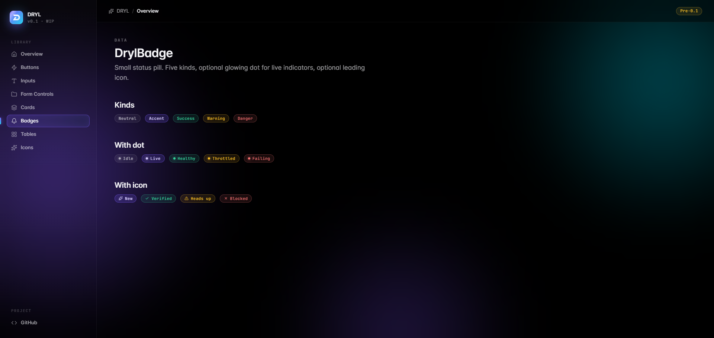
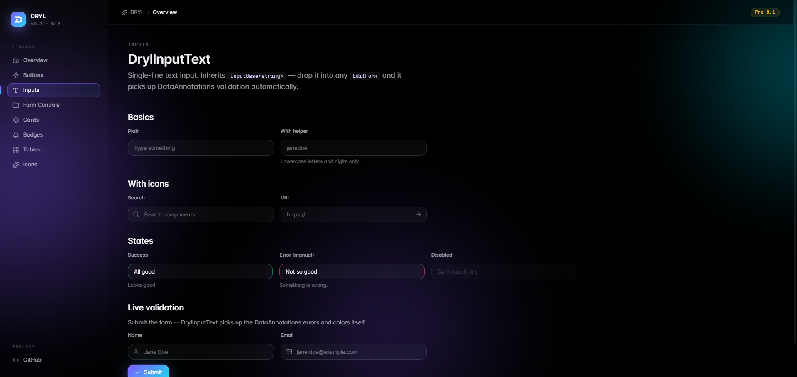
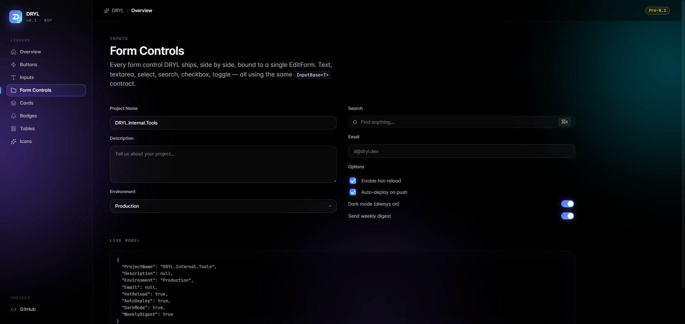
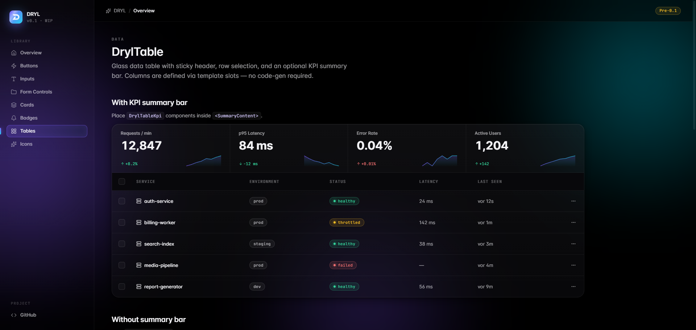
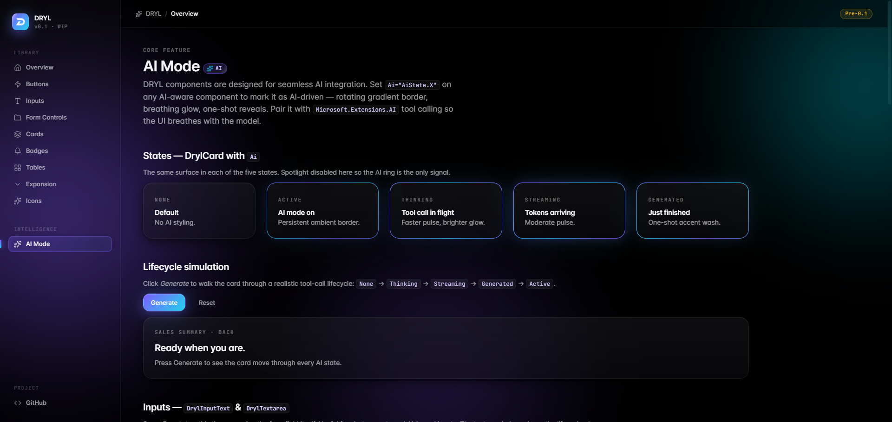
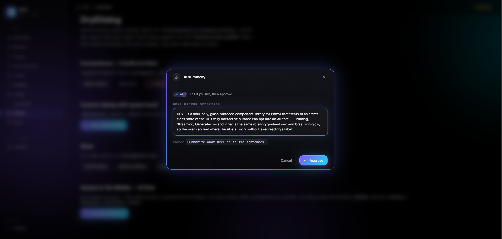
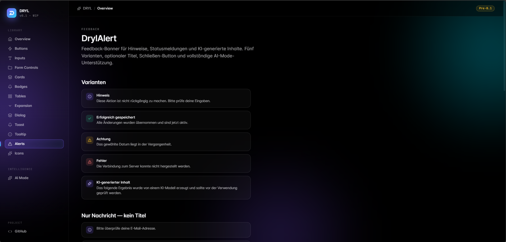

# DRYL

[](https://www.nuget.org/packages/DRYL.Components)
[](https://www.nuget.org/packages/DRYL.Components)
[](https://github.com/Zimpi/DRYL.Components/actions/workflows/ci.yml)
[](LICENSE)
[](https://dotnet.microsoft.com/)
[](https://github.com/sponsors/Zimpi)

An open-source UI component library for **Blazor Server** and **Blazor WebAssembly** with an unapologetically modern, dark aesthetic.

```bash
dotnet add package DRYL.Components
```

> **Status: Early development — not production-ready.**
> DRYL is being built in the open. The design system is in place and several reference components exist, but the library is **not yet suitable for production use**. Expect breaking changes, missing components, and rough edges until `1.0`.

---

## Vision

DRYL is **dark, glassy, alive — and AI-native**.

Most Blazor component libraries feel like ports of Bootstrap or Material — safe, neutral, indistinguishable. DRYL is the opposite. Surfaces are translucent layers stacked on pure black, accents glow in a violet-to-cyan gradient, and motion is intentional rather than decorative.

The goal is a small, opinionated set of components — buttons, cards, inputs, tables, modals, navigation — that look like they belong in a product built in 2026, not 2014. And because 2026 products are increasingly driven by language models and tool calling, every DRYL surface knows how to **wear its AI state**: a card filled by a model breathes with a rotating gradient border, an input bound to a streaming completion glows while tokens arrive, and a generated block reveals itself with a one-shot accent wash. The result is a system where you can feel which parts of the UI are alive with AI without ever reading a label.

Every component reads from a single token file ([`dryl.css`](DRYL.Components/wwwroot/dryl.css)), so the entire visual language can be re-tuned in one place.

**Principles**

- **Token-driven.** Every color, spacing, radius, shadow and duration is a CSS variable. No magic numbers.
- **Dark only.** No light theme. Dark is the design, not a toggle.
- **Glass surfaces.** Translucent layers with `backdrop-filter`, never solid blocks.
- **AI-aware.** Every interactive surface can opt into an `AiState` — Active, Thinking, Streaming, Generated. The system signals AI presence consistently across components, so users learn the visual language once.
- **No JS frameworks.** Zero npm packages on top of Blazor — just CSS, Razor, and minimal interop.
- **Accessible by default.** Keyboard-reachable, ARIA-labeled, visible focus rings. AI activity is announced via `aria-live`.

---

## Installation & getting started

DRYL targets **.NET 8, 9 and 10**.

**1. Add the package**

```bash
dotnet add package DRYL.Components
```

**2. Register services** in `Program.cs`

```csharp
builder.Services.AddDrylComponents();
```

**3. Reference the stylesheet** in your host page (`App.razor` / `_Host.cshtml` / `wwwroot/index.html`)

```html
<link rel="stylesheet" href="_content/DRYL.Components/dryl.css" />
```

**4. Add the providers** once in your root layout (for service-driven dialogs, toasts and notifications)

```razor
<DrylDialogProvider />
<DrylToastProvider />
```

**5. Use components**

```razor
@using DRYL.Components

<DrylCard>
    <DrylButton Variant="ButtonVariant.Primary">Hello DRYL</DrylButton>
</DrylCard>
```

---

## Preview

### Design system overview


### Buttons


### Cards


### Badges


### Text input


### Form controls


### Tables


### AI Mode


### Dialog


### Alerts


---

## AI Mode — first-class citizen

DRYL treats AI as a **first-class state of the UI**, not an afterthought. Every surface in the library that can carry AI-generated content accepts a single `Ai` parameter of type `AiState`. That one parameter drives a consistent, learnable visual vocabulary — users see the same rotating gradient border on a card that's streaming tokens as they do on an expansion panel being filled by a tool call.

### The five states

| State        | Visual                                                          | When to use                                                |
| ------------ | --------------------------------------------------------------- | ---------------------------------------------------------- |
| `None`       | Default styling — no AI signal.                                 | Surface is rendered normally, unrelated to AI output.      |
| `Active`     | Slow rotating gradient border + breathing accent glow.          | Persistent AI-driven surface (a chat panel, an LLM card).  |
| `Thinking`   | Faster pulse on border and glow.                                | A tool call is in flight.                                  |
| `Streaming`  | Moderate pulse; content updates incrementally.                  | Tokens are arriving from the model.                        |
| `Generated`  | One-shot accent wash sweep + soft lift.                         | Reveal moment immediately after generation completes.       |

### AI-aware components

All AI-aware components share the same `Ai="AiState.X"` API. The effects are implemented entirely in CSS (`dryl.css`) with no component-specific overrides, so the ring, glow and wash look identical across:

- **`DrylCard`** — glass surface with cursor spotlight; ring draws around the card border
- **`DrylButton`** — rotating ring sits outside the variant fill; useful for "Ask AI" CTA buttons
- **`DrylInputText` / `DrylTextarea`** — ring wraps the input field; ideal for prompts bound to streaming completions
- **`DrylTable`** — ring wraps the full table; rows animate in as they stream
- **`DrylExpansion`** — ring wraps the panel header; the panel can open automatically when the model starts streaming its body
- **`DrylAlert`** — ring wraps the feedback banner; ideal for surfacing AI-generated warnings, summaries or status updates with a dedicated `Ai` kind
- **`DrylAiIndicator`** — companion status pill that adapts its label and pulse speed to the current state

### Wiring with `Microsoft.Extensions.AI`

```csharp
private AiState _state = AiState.None;

private async Task AskAi()
{
    _state = AiState.Thinking;
    var response = await chatClient.GetStreamingResponseAsync(prompt);

    _state = AiState.Streaming;
    await foreach (var chunk in response)
    {
        _text += chunk.Text;
        StateHasChanged();
    }

    _state = AiState.Generated;   // one-shot wash
    await Task.Delay(900);
    _state = AiState.Active;      // settle back to idle AI mode
}
```

```razor
<DrylCard Ai="@_state">
    <DrylAiIndicator State="@_state" />
    @_text
</DrylCard>

<DrylExpansion Title="AI summary" Icon="Sparkle" Ai="@_state" @bind-Open="_open">
    <ChildContent>@_text</ChildContent>
</DrylExpansion>
```

The CSS primitives behind this (`.ai-aura`, `.ai-aura-ring`, `.ai-aura-glow`, `.ai-aura-wash`) live in [`dryl.css`](DRYL.Components/wwwroot/dryl.css) and can be applied to any element that isn't yet a DRYL component.

---

## Dialog & DialogService

DRYL ships a service-driven dialog system inspired by the patterns popularised by MudBlazor's `IDialogService`, but built on the DRYL glass aesthetic and **AI-native from day one**. The dialog is the natural place to host a **"human in the middle"** flow: the model proposes, the user reviews, the user approves or edits.

### Setup

```csharp
// Program.cs
builder.Services.AddDrylComponents();
```

```razor
@* App.razor or MainLayout.razor — once, at the root *@
<DrylDialogProvider />
```

### Showing a dialog

```csharp
@inject IDrylDialogService Dialogs

var reference = await Dialogs.ShowAsync<MyDialog>(
    title: "Edit profile",
    parameters: new DialogParameters { ["UserId"] = id },
    options: new DialogOptions { Size = DialogSize.Large });

var result = await reference.Result;
if (!result.Canceled)
{
    var payload = result.DataAs<MyPayload>();
}
```

### Convenience helpers

```csharp
var ok = await Dialogs.ShowConfirmAsync("Delete project?", "This cannot be undone.");
await Dialogs.ShowAlertAsync("Deployment failed", "See logs for details.");
```

### Authoring a dialog

```razor
@* MyDialog.razor — shown via IDrylDialogService *@
<DrylDialog Title="Edit profile" Ai="@_ai">
    <ChildContent>
        <DrylInputText @bind-Value="_name" Label="Name" />
    </ChildContent>
    <ActionContent>
        <DrylButton Variant="DrylButton.ButtonVariant.Ghost" @onclick="Cancel">Cancel</DrylButton>
        <DrylButton Variant="DrylButton.ButtonVariant.Primary" @onclick="Save">Save</DrylButton>
    </ActionContent>
</DrylDialog>

@code {
    [CascadingParameter] IDrylDialogInstance Instance { get; set; } = default!;
    [Parameter] public Guid UserId { get; set; }
    private string _name = "";
    private AiState _ai = AiState.None;

    void Save()   => Instance.Close(DialogResult.Ok(_name));
    void Cancel() => Instance.Cancel();
}
```

### Human in the Middle

The `Ai` parameter on `DrylDialog` walks the standard `AiState` lifecycle and the existing AI primitives carry the visual story — there is no per-component AI vocabulary. A typical wiring with `Microsoft.Extensions.AI`:

```csharp
_ai = AiState.Thinking;
await foreach (var chunk in chatClient.GetStreamingResponseAsync(prompt))
{
    if (_ai != AiState.Streaming) _ai = AiState.Streaming;
    _generated += chunk.Text;
    StateHasChanged();
}
_ai = AiState.Generated;   // one-shot reveal
// User can now edit `_generated` in a DrylTextarea and Approve / Cancel.
```

Every step is visible to the user through the dialog's border and glow — the model is at work, the model is streaming, the model is done, the user is in control.

---

## DrylTable — declarative data grid

`DrylTable<TItem>` is the workhorse for displaying tabular data. Columns are declared with `DrylColumn<TItem>` child components — each column knows whether it is sortable, filterable, or searchable, which removes the need to wire up headers and row templates separately.

### Minimal

```razor
<DrylTable TItem="Service" Items="@services" AriaLabel="Services">
    <Columns>
        <DrylColumn TItem="Service" Field="@(s => s.Name)"   Title="Service" Sortable Searchable Primary />
        <DrylColumn TItem="Service" Field="@(s => s.Status)" Title="Status" Sortable />
    </Columns>
</DrylTable>
```

### Full enterprise setup

```razor
<DrylTable TItem="Service"
           Items="@services"
           ShowToolbar Searchable
           PageSize="20"
           Selectable
           AriaLabel="Services">
    <Columns>
        <DrylColumn TItem="Service" Field="@(s => s.Name)"
                    Title="Service" Sortable Searchable Filterable Primary />
        <DrylColumn TItem="Service" Field="@(s => s.Environment)"
                    Title="Env" Sortable Filterable
                    FilterType="ColumnFilterType.Select" />
        <DrylColumn TItem="Service" Field="@(s => s.LatencyMs)"
                    Title="Latency" Sortable Align="ColumnAlign.End" Width="120px">
            <CellTemplate Context="s">@(s.LatencyMs is { } n ? $"{n} ms" : "—")</CellTemplate>
        </DrylColumn>
    </Columns>
</DrylTable>
```

The pipeline runs **search → filter → sort → page** entirely client-side. Toolbar shows the global search input plus active-filter chips with one-click removal. Headers cycle `none → asc → desc → none` on click; Shift-click adds to a multi-sort. Filter popovers open inline at the header — text input for free-form columns, multi-select for enums / bools / explicit `Select` filters.

### Grouping, detail rows, row actions and bulk actions

```razor
<DrylTable TItem="Service" Items="@services"
           ShowToolbar Searchable Selectable
           GroupBy="@(s => s.Environment)"
           PageSize="20">
    <Columns> ... </Columns>

    <DetailTemplate Context="s">
        <div class="p-default">Full diagnostics for @s.Name…</div>
    </DetailTemplate>

    <RowActions Context="s">
        <DrylButton Variant="ButtonVariant.Ghost" Size="ButtonSize.Small"
                    LeadingIcon="Settings" AriaLabel="Edit" OnClick="() => Edit(s)" />
    </RowActions>

    <BulkActions Context="selected">
        <DrylButton Variant="ButtonVariant.Danger" Size="ButtonSize.Small"
                    OnClick="() => DeleteAll(selected)">
            Delete @selected.Count
        </DrylButton>
    </BulkActions>
</DrylTable>
```

`GroupBy` clusters rows under collapsible mono-styled headers. `DetailTemplate` adds an expand chevron column and reveals a glass panel under the row. `RowActions` appends a trailing actions column. `BulkActions` floats a glass action bar above the toolbar while any row is selected.

### Virtualization, sticky header, column visibility and state persistence

```razor
<DrylTable TItem="Service" Items="@manyServices"
           ShowToolbar Searchable
           Virtualize Height="480px"
           AllowColumnVisibility
           PersistStateKey="services-table">
    <Columns>
        <DrylColumn TItem="Service" Field="@(s => s.Name)" Title="Service" Sortable Primary />
        <DrylColumn TItem="Service" Field="@(s => s.LatencyMs)" Title="Latency" Sortable Hidden />
        ...
    </Columns>
</DrylTable>
```

`Virtualize` renders only the rows in view via the framework's `Virtualize` component — pair it with a fixed `Height`. `StickyHeader` (on by default) anchors the header to the top of the scroll area. `AllowColumnVisibility` shows a Settings-icon menu in the toolbar to toggle columns. `PersistStateKey` snapshots sort / filters / page / page-size / hidden-columns to `localStorage` on every change and restores on first render. `Hidden` on a `DrylColumn` sets the initial collapsed state.

### Server-side via `DataProvider`

For large datasets, hand the table a `DataProvider` callback. It receives a `DataRequest` snapshot (`Skip`, `Take`, `SearchText`, `Sort`, `Filters`) and returns a `DataResult<TItem>` with the page and total count. When `DataProvider` is set, `Items` is ignored.

```csharp
async ValueTask<DataResult<Service>> LoadAsync(DataRequest req, CancellationToken ct)
{
    var query = repo.Services
        .ApplySearch(req.SearchText)
        .ApplyFilters(req.Filters)
        .ApplySort(req.Sort);

    var total = await query.CountAsync(ct);
    var page  = await query.Skip(req.Skip).Take(req.Take).ToListAsync(ct);
    return new DataResult<Service>(page, total);
}
```

```razor
<DrylTable TItem="Service" DataProvider="LoadAsync" Searchable ShowToolbar PageSize="20">
    <Columns> ... </Columns>
</DrylTable>
```

### Standalone pagination

`DrylPagination` is also usable on its own — drop it under any list, gallery or feed.

```razor
<DrylPagination @bind-CurrentPage="page"
                @bind-PageSize="size"
                TotalCount="@total" />
```

---

## What's in the box (today)

| Component         | Category     | AI mode | Status     | Notes                                                              |
| ----------------- | ------------ | ------- | ---------- | ------------------------------------------------------------------ |
| `DrylButton`      | Actions      | ✅      | ✅ Done    | Primary / Secondary / Ghost / Danger, sizes, loading, icon slots, sheen + spring hover |
| `DrylButtonGroup` | Actions      | —       | ✅ Done    | Segments related buttons into one outline; clustered actions or `Pressed` toggle group |
| `DrylSplitButton` | Actions      | ✅      | ✅ Done    | Primary action + caret `DrylMenu` of variants ("Save ▾"); shared variant/size, AI-aware |
| `DrylMenu`        | Actions      | —       | ✅ Done    | Dropdown menu; 4 placements, icons, shortcuts, Danger items, separators |
| `DrylMenuItem`    | Actions      | —       | ✅ Done    | Menu item used inside `DrylMenu`; Default / Danger variant, separator, header |
| `DrylCommandPalette` | Actions   | ✅      | ✅ Done    | Command launcher overlay; Ctrl+K; static + async search; Navigate / Action / AiIntent items; category grouping; AI result panel |
| `DrylBreadcrumbs` | Navigation   | —       | ✅ Done    | Hierarchical trail; custom separator; `MaxItems` ellipsis collapse; `aria-current` on last crumb |
| `DrylBreadcrumbItem` | Navigation | —      | ✅ Done    | Single crumb inside `DrylBreadcrumbs`; `Href` link or current page; optional icon |
| `DrylCard`        | Surfaces     | ✅      | ✅ Done    | Glass surface, optional cursor spotlight, `Ai` state              |
| `DrylBadge`       | Data         | —       | ✅ Done    | Neutral / Accent / Success / Warning / Danger, optional dot       |
| `DrylAvatar`      | Data         | —       | ✅ Done    | Image → initials → icon fallback; sizes, Circle / Square, presence status dot |
| `DrylAvatarGroup` | Data         | —       | ✅ Done    | Overlapping stack; cascades size; `Max` collapses overflow to `+N` |
| `DrylSparkline`   | Data         | —       | ✅ Done    | Inline-SVG trend chart (zero JS); Line / Area / Bar; accent gradient |
| `DrylStat`        | Data         | ✅      | ✅ Done    | KPI card; value + delta chip + sparkline slot; glass surface |
| `DrylTimeline`    | Data         | —       | ✅ Done    | Vertical event rail; hosts `DrylTimelineItem`s |
| `DrylTimelineItem`| Data         | ✅      | ✅ Done    | Event marker (5 variants), title, timestamp, body; AI agent step traces |
| `DrylTreeView`    | Data         | —       | ✅ Done    | Hierarchical tree; `@bind-SelectedValue`; WAI-ARIA keyboard nav, roving tabindex |
| `DrylTreeNode`    | Data         | —       | ✅ Done    | Tree node; `Text` / `Icon` / `Value` / `@bind-Expanded`; chevron, nesting |
| `DrylIcon`        | Data         | —       | ✅ Done    | Lucide-based icon set, used by Button, Badge and others           |
| `DrylImage`       | Data         | ✅      | ✅ Done    | Responsive image; auto aspect-ratio, skeleton, fallback; AI blur-to-sharp reveal |
| `DrylAiIndicator` | Intelligence | ✅      | ✅ Done    | Pulsing status pill that adapts label and speed to `AiState`      |
| `DrylAiScope`     | Intelligence | ✅      | ✅ Done    | Coordinates `AiState` across descendants by operation key; service- or `State`-driven; child `Ai` wins |
| `DrylAiStream`    | Intelligence | ✅      | ✅ Done    | Binds an `IAsyncEnumerable<string>` token stream to the UI; auto Thinking→Streaming→Generated; lights up a `DrylAiScope` |
| `DrylToolCall`    | Intelligence | ✅      | ✅ Done    | Agent tool/function call: name, live status pill, collapsible JSON args/result; `Error` alert; stack in `DrylTimeline` |
| `DrylInputText`   | Inputs       | ✅      | ✅ Done    | Form-bound text input with leading / trailing icon slots          |
| `DrylInputPassword` | Inputs     | ✅      | ✅ Done    | Password input with show/hide eye toggle; inherits `InputBase<string>` |
| `DrylInputNumber<TValue>` | Inputs | ✅   | ✅ Done    | Generic numeric input; optional ± stepper; int / long / decimal / double / float |
| `DrylCheckbox`    | Inputs       | —       | ✅ Done    | Accessible checkbox with label                                    |
| `DrylSelect`      | Inputs       | ✅      | ✅ Done    | Custom dropdown; `Items: SelectItem[]`; glass panel, AI-aware     |
| `DrylMultiSelect` | Inputs       | ✅      | ✅ Done    | Multi-selection dropdown; removable chips; `@bind-SelectedValues` |
| `DrylRadioGroup<TValue>` | Inputs | ✅     | ✅ Done    | Radio group inheriting `InputBase<TValue>`; Vertical / Horizontal |
| `DrylRadio<TValue>` | Inputs     | —       | ✅ Done    | Single radio option inside `DrylRadioGroup`; cascading context    |
| `DrylSegmentedControl<TValue>` | Inputs | — | ✅ Done | iOS-style mode switch; gliding indicator; `@bind-Value`; arrow-key nav |
| `DrylSegment<TValue>` | Inputs   | —       | ✅ Done    | Single segment inside `DrylSegmentedControl`; cascading context   |
| `DrylTextarea`    | Inputs       | ✅      | ✅ Done    | Auto-resizable textarea                                           |
| `DrylToggle`      | Inputs       | —       | ✅ Done    | On/off toggle switch                                              |
| `DrylSlider`      | Inputs       | ✅      | ✅ Done    | Range slider bound to `double`; accent gradient fill, AI-aware    |
| `DrylFileUpload`  | Inputs       | ✅      | ✅ Done    | Drag-and-drop / click-to-browse; multiple files; `FilesChanged` callback |
| `DrylAutocomplete<TItem>` | Inputs | ✅   | ✅ Done    | Generic combobox; client-side `SearchFunc`, async `ItemsProvider`, custom `ItemTemplate`, ARIA combobox |
| `DrylDatePicker`  | Inputs       | ✅      | ✅ Done    | Calendar panel; ARIA grid keyboard nav, Min/Max, date range mode  |
| `DrylTimePicker`  | Inputs       | ✅      | ✅ Done    | Time-only picker; scrollable hour/minute panel; Min/Max; MinuteStep |
| `DrylChipInput`   | Inputs       | ✅      | ✅ Done    | Free-text tag field; Enter/comma to commit; @bind-Tags; MaxTags   |
| `DrylInputOtp`    | Inputs       | ✅      | ✅ Done    | Fixed-box OTP entry; auto-advance; paste-to-fill; configurable Digits |
| `DrylInputMask`   | Inputs       | ✅      | ✅ Done    | Masked input; Phone/IBAN/PostalCode/CreditCard/Custom patterns    |
| `DrylRating`      | Inputs       | ✅      | ✅ Done    | Star rating; hover preview; AllowClear; ReadOnly; keyboard nav    |
| `DrylTable`       | Data         | ✅      | ✅ Done    | Declarative columns, search, multi-sort, filters, pagination, grouping, row detail, inline editing (row/cell), row reorder, column resize / reorder / pin, row + bulk actions, virtualization, column visibility, CSV export, `PersistStateKey`, optional `DataProvider` |
| `DrylColumn`      | Data         | —       | ✅ Done    | Declarative column for `DrylTable` — `Sortable`, `Searchable`, `Filterable`, `Pinned`, `Resizable`, `Hidden`, custom `CellTemplate` / `EditTemplate` / `HeaderTemplate`, alignment |
| `DrylPagination`  | Data         | —       | ✅ Done    | Standalone page navigator: First / Prev / numbers (smart-ellipsis) / Next / Last + page-size selector + "Showing X–Y of Z" |
| `DrylExpansion`   | Layout       | ✅      | ✅ Done    | Collapsible glass panel; stacked panels share borders and detach on open |
| `DrylLayout`      | Layout       | —       | ✅ Done    | Root shell — CSS grid; `SidebarWidth`, app-bar-driven collapse coordination |
| `DrylAppBar`      | Layout       | —       | ✅ Done    | Sticky top bar; `Elevation`, `Start`/`Center`/`End` slots, drawer + sidebar toggles |
| `DrylDrawer`      | Layout       | —       | ✅ Done    | Sidebar; `Mode` Auto/Static/Collapsible/Pinnable/Flyout, `@bind-Collapsed`, slots |
| `DrylMainContent` | Layout       | —       | ✅ Done    | Main content slot inside `DrylLayout`; handles scroll and padding |
| `DrylNavGroup`    | Layout       | —       | ✅ Done    | Labelled group; `Collapsible` + `DefaultExpanded` for accordion sub-menus; optional `Href` makes the header a NavLink |
| `DrylNavLink`     | Layout       | —       | ✅ Done    | Single nav row; `Sub` renders indented child item inside a collapsible group; supports external links |
| `DrylStepper`     | Layout       | —       | ✅ Done    | Multi-step wizard container; Horizontal / Vertical orientation, `@bind-ActiveStep` |
| `DrylStep`        | Layout       | ✅      | ✅ Done    | Single step inside `DrylStepper`; Pending / Active / Completed / Error states, AI ring |
| `DrylScrollArea`  | Layout       | —       | ✅ Done    | Scrollable region with thin DRYL scrollbar; `MaxHeight` / `MaxWidth` / `Horizontal`; pure CSS |
| `DrylTypo`        | Layout       | —       | ✅ Done    | Type scale primitive; `Variant` look + `As` tag, `Color`, `Align`, `Gradient` |
| `DrylStack`       | Layout       | —       | ✅ Done    | Flex layout; `Direction` / `Gap` / `Align` / `Justify` / `Wrap`; replaces row/col markup |
| `DrylList`        | Layout       | —       | ✅ Done    | Token-driven list; marker `Variant`, `Density`, `Dividers`, ordered; nesting |
| `DrylListItem`    | Layout       | —       | ✅ Done    | List row; `Icon`, `Start` / `End` slots, `Selected` / `Disabled`, `OnClick` |
| `DrylDivider`     | Layout       | —       | ✅ Done    | Thin rule; horizontal / vertical, optional centred label ("— or —") |
| `DrylDialog`      | Surfaces     | ✅      | ✅ Done    | Service-driven glass dialog, focus trap, sizes, AI-aware (Human in the Middle) |
| `DrylToast`       | Surfaces     | ✅      | ✅ Done    | Service-driven toast stack; auto-dismiss, progress bar, hover-pause, 6 positions |
| `DrylChat`        | Surfaces     | ✅      | ✅ Done    | Conversation surface; scrollable log + pinned composer slot; auto-scroll; `role="log"` aria-live |
| `DrylMessage`     | Surfaces     | ✅      | ✅ Done    | Chat bubble; User / Assistant / System roles; author, timestamp, avatar, typing dots; optional `Markdown`/`Text` for rich LLM output |
| `DrylChatComposer`| Surfaces     | ✅      | ✅ Done    | Chat input; Enter sends, Shift+Enter newline, auto-grow textarea; `OnSend` callback |
| `DrylPopover`     | Surfaces     | —       | ✅ Done    | Anchored floating-panel primitive; portals to `<body>` (never clipped); placement, click-outside / Escape, match-width |
| `DrylEmptyState`  | Feedback     | ✅      | ✅ Done    | "No data" placeholder; icon, title, description, action slot; sizes; AI-aware |
| `DrylDescriptionList` | Data     | —       | ✅ Done    | Semantic `<dl>` key/value view; Stacked / Inline; columns |
| `DrylDescriptionItem` | Data     | —       | ✅ Done    | Term/value pair inside `DrylDescriptionList` |
| `DrylKbd`         | Data         | —       | ✅ Done    | Keyboard-shortcut `<kbd>` chips; single key or `Keys` chord with `Separator`; pure CSS |
| `DrylCodeBlock`   | Data         | ✅      | ✅ Done    | Glass code surface; server-side syntax highlighting (8 langs, zero-JS); copy button; line numbers; HTML-encoded; AI-aware |
| `DrylMarkdown`    | Surfaces     | ✅      | ✅ Done    | Renders Markdown (CommonMark + GFM via Markdig); fenced code → `DrylCodeBlock`; raw HTML disabled (XSS-safe); streaming |
| `DrylCitation`    | Data         | —       | ✅ Done    | Inline `[n]` source-attribution chip; popover with title / URL / snippet for RAG answers |
| `DrylCitationList`| Data         | —       | ✅ Done    | Numbered source list (`<ol>`) for `DrylCitationListItem`s; complements inline chips |
| `DrylFormField`   | Inputs       | —       | ✅ Done    | Generic label + required + hint + inline validation wrapper (`For` expression) |
| `DrylValidationSummary` | Inputs | —       | ✅ Done    | Glass summary of all EditForm validation errors |
| `DrylTooltip`     | Feedback     | —       | ✅ Done    | CSS-only hover tooltip; 4 placements (Top / Bottom / Left / Right), wraps any trigger |
| `DrylAlert`       | Feedback     | ✅      | ✅ Done    | Feedback-Banner; 5 Varianten (Info / Success / Warning / Danger / Ai), optionaler Titel, Dismissible, AI-aware |
| `DrylSpinner`     | Feedback     | ✅      | ✅ Done    | Ring / Dots / Pulse variants; Small / Medium / Large; animation rate adapts to AI state |
| `DrylProgress`    | Feedback     | ✅      | ✅ Done    | Linear bar; determinate / indeterminate; Accent / Success / Warning / Danger; sizes; percentage label |
| `DrylSkeleton`    | Feedback     | ✅      | ✅ Done    | Line / Text / Avatar / Card / Image / Custom; Streaming shifts shimmer to violet-cyan gradient |
| `DrylErrorBoundary` | Feedback   | ✅      | ✅ Done    | Glass fallback around Blazor `ErrorBoundary`; retry / recover, dev-only detail toggle, custom fallback, AI-aware |
| `DrylNotifications` | Feedback   | ✅      | ✅ Done    | Bell + badge + popover inbox; service-driven or controlled, mark-read, dismiss, AI-aware entries |

For the full design language, see [`DESIGN_TOKENS.md`](DESIGN_TOKENS.md) and [`COMPONENT_PATTERNS.md`](COMPONENT_PATTERNS.md).

---

## Repository layout

```
DRYL.Components/             The library (Razor Class Library, .NET 10)
  AiState.cs                 The AI state enum — shared across all AI-aware components
  Components/
    Actions/                 DrylButton, DrylButtonGroup, DrylSplitButton
    AI/                      DrylAiIndicator, DrylAiScope, DrylAiStream (AI-specific components live here)
    Data/                    DrylBadge, DrylIcon, DrylTable, DrylTableKpi, DrylColumn, DrylPagination
      Models/                SortDescriptor, FilterDescriptor, DataRequest, DataResult, ColumnAlign, ColumnFilterType
    Inputs/                  DrylInputText, DrylCheckbox, DrylSelect, DrylTextarea, DrylToggle
    Layout/                  DrylExpansion, DrylLayout, DrylMainContent, DrylAppBar, DrylDrawer, DrylNavGroup, DrylNavLink
    Surfaces/                DrylCard, DrylDialog, DrylDialogProvider, DrylToast, DrylToastProvider
  Ai/                        IDrylAiActivityService, IDrylAiOperation, AiScope, AiStreamContext, DrylAiAware
  Dialogs/                   IDrylDialogService, DialogOptions, DialogResult, DialogParameters
  Toasts/                    IDrylToastService, ToastOptions, ToastVariant, ToastPosition
  Extensions/                ServiceCollectionExtensions (AddDrylComponents)
  wwwroot/
    dryl.css                 The single stylesheet — every token, every primitive (incl. AI mode)
    js/dryl.js               Minimal JS interop (namespaced as window.dryl.*)

samples/DRYL.Components.Demo/   Sample Blazor app showing all components live
prototype/                       Original HTML prototype — visual target
CLAUDE.md                        Rules for AI agents contributing to DRYL
DESIGN_TOKENS.md                 Token reference
COMPONENT_PATTERNS.md            Component anatomy & folder conventions
```

---

## Try it locally

DRYL is not yet published to NuGet. To explore the demo app:

```bash
git clone https://github.com/Zimpi/DRYL.Components.git
cd DRYL.Components
dotnet run --project samples/DRYL.Components.Demo
```

---

## Contributing

Right now this is a solo effort, but contributions will be welcome once the core stabilizes. If you want to help:

1. Read [`CLAUDE.md`](CLAUDE.md) — the contribution rules (they apply to humans too).
2. Open an issue before starting work on a new component.
3. Every PR must respect the token system. No invented colors, no arbitrary spacings.

---

## Support DRYL

DRYL is built and maintained in the open as a solo effort. If it saves you time
or you'd like to see it reach a stable 1.0 faster, you can support the work:

[](https://github.com/sponsors/Zimpi)

- **[GitHub Sponsors](https://github.com/sponsors/Zimpi)** — one-off or recurring.

Sponsorships are appreciated but never required: DRYL is MIT-licensed and will
always be free to use. Starring the repo and filing good issues helps just as
much.

---

## Credits

DRYL stands on the shoulders of these open-source projects:

- **[Lucide](https://lucide.dev)** — the icon set behind `DrylIcon`. ISC-licensed. Some Lucide icons themselves derive from [Feather Icons](https://feathericons.com) (MIT, Cole Bemis).
- **[Inter](https://rsms.me/inter/)** by Rasmus Andersson — primary UI typeface. SIL Open Font License.
- **[JetBrains Mono](https://www.jetbrains.com/mono/)** — monospace typeface used for code, IDs and timestamps. SIL Open Font License.

Full license texts for bundled third-party assets are in [`THIRD_PARTY_NOTICES.md`](THIRD_PARTY_NOTICES.md).

---

## License

MIT — see [`LICENSE`](LICENSE). Use it, fork it, ship it.
