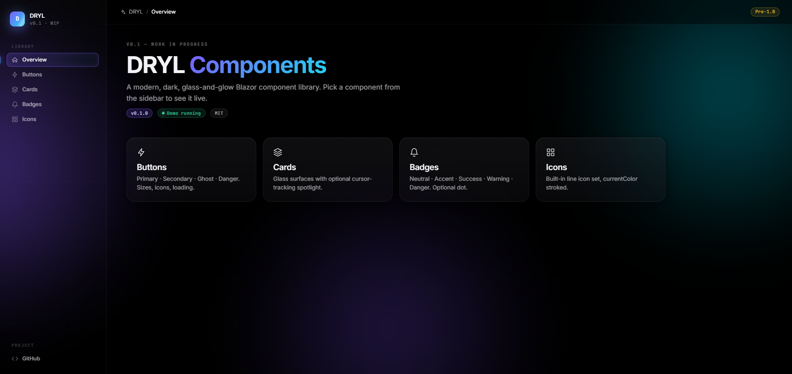
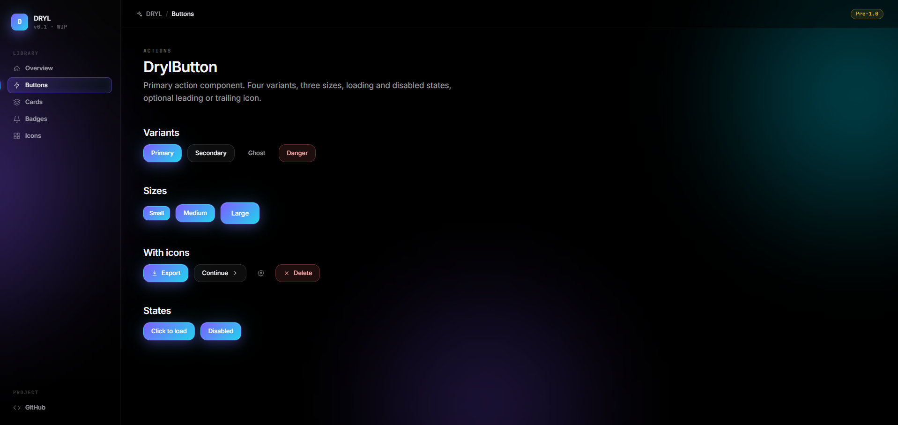
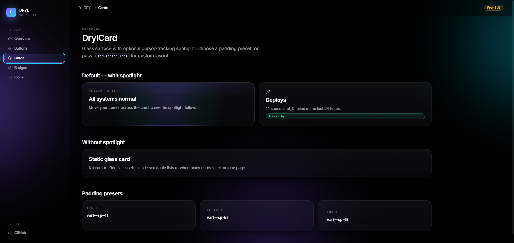

# DRYL

An open-source UI component library for **Blazor Server** and **Blazor WebAssembly** with an unapologetically modern, dark aesthetic.

> **Status: Early development — not production-ready.**
> DRYL is being built in the open. The design system is in place and several reference components exist, but the library is **not yet suitable for production use**. Expect breaking changes, missing components, and rough edges until `1.0`.

---

## Vision

DRYL is **dark, glassy, alive**.

Most Blazor component libraries feel like ports of Bootstrap or Material — safe, neutral, indistinguishable. DRYL is the opposite. Surfaces are translucent layers stacked on pure black, accents glow in a violet-to-cyan gradient, and motion is intentional rather than decorative.

The goal is a small, opinionated set of components — buttons, cards, inputs, tables, modals, navigation — that look like they belong in a product built in 2026, not 2014. Every component reads from a single token file ([`dryl.css`](DRYL.Components/wwwroot/dryl.css)), so the entire visual language can be re-tuned in one place.

**Principles**

- **Token-driven.** Every color, spacing, radius, shadow and duration is a CSS variable. No magic numbers.
- **Dark only.** No light theme. Dark is the design, not a toggle.
- **Glass surfaces.** Translucent layers with `backdrop-filter`, never solid blocks.
- **No JS frameworks.** Zero npm packages on top of Blazor — just CSS, Razor, and minimal interop.
- **Accessible by default.** Keyboard-reachable, ARIA-labeled, visible focus rings.

---

## Preview

### Design system overview


### Buttons


### Cards


---

## What's in the box (today)

| Component       | Category | Status    | Notes                                                              |
| --------------- | -------- | --------- | ------------------------------------------------------------------ |
| `DrylButton`    | Actions  | ✅ Done   | Primary / Secondary / Ghost / Danger, sizes, loading, icon slots  |
| `DrylCard`      | Surfaces | ✅ Done   | Glass surface with optional cursor-tracking spotlight              |
| `DrylBadge`     | Data     | ✅ Done   | Neutral / Accent / Success / Warning / Danger, optional dot       |
| `DrylIcon`      | Data     | ✅ Done   | Lucide-based icon set, used by Button, Badge and others           |
| `DrylInputText` | Inputs   | ✅ Done   | Form-bound text input with leading / trailing icon slots          |
| `DrylCheckbox`  | Inputs   | ✅ Done   | Accessible checkbox with label                                    |
| `DrylSelect`    | Inputs   | ✅ Done   | Styled select bound to `EditForm`                                 |
| `DrylTextarea`  | Inputs   | ✅ Done   | Auto-resizable textarea                                           |
| `DrylToggle`    | Inputs   | ✅ Done   | On/off toggle switch                                              |
| `DrylTable`     | Data     | 🔜 Planned | Data grid with sticky header, sortable columns                   |
| `DrylModal`     | Surfaces | 🔜 Planned | Glass overlay with focus trap                                    |
| `DrylToast`     | Surfaces | 🔜 Planned | Programmatic notifications via service                           |

For the full design language, see [`DESIGN_TOKENS.md`](DESIGN_TOKENS.md) and [`COMPONENT_PATTERNS.md`](COMPONENT_PATTERNS.md).

---

## Repository layout

```
DRYL.Components/             The library (Razor Class Library, .NET 10)
  Components/
    Actions/                 DrylButton
    Data/                    DrylBadge, DrylIcon
    Inputs/                  DrylInputText, DrylCheckbox, DrylSelect, DrylTextarea, DrylToggle
    Surfaces/                DrylCard
  wwwroot/
    dryl.css                 The single stylesheet — every token, every primitive
    js/dryl.js               Minimal JS interop (namespaced as window.dryl.*)

samples/DRYL.Components.Demo/   Sample Blazor app showing all components live
prototype/                       Original HTML prototype — visual target
CLAUDE.md                        Rules for AI agents contributing to DRYL
DESIGN_TOKENS.md                 Token reference
COMPONENT_PATTERNS.md            Component anatomy & folder conventions
```

---

## Try it locally

DRYL is not yet published to NuGet. To explore the demo app:

```bash
git clone https://github.com/Zimpi/DRYL.Components.git
cd DRYL.Components
dotnet run --project samples/DRYL.Components.Demo
```

---

## Contributing

Right now this is a solo effort, but contributions will be welcome once the core stabilizes. If you want to help:

1. Read [`CLAUDE.md`](CLAUDE.md) — the contribution rules (they apply to humans too).
2. Open an issue before starting work on a new component.
3. Every PR must respect the token system. No invented colors, no arbitrary spacings.

---

## Credits

DRYL stands on the shoulders of these open-source projects:

- **[Lucide](https://lucide.dev)** — the icon set behind `DrylIcon`. ISC-licensed. Some Lucide icons themselves derive from [Feather Icons](https://feathericons.com) (MIT, Cole Bemis).
- **[Inter](https://rsms.me/inter/)** by Rasmus Andersson — primary UI typeface. SIL Open Font License.
- **[JetBrains Mono](https://www.jetbrains.com/mono/)** — monospace typeface used for code, IDs and timestamps. SIL Open Font License.

Full license texts for bundled third-party assets are in [`THIRD_PARTY_NOTICES.md`](THIRD_PARTY_NOTICES.md).

---

## License

MIT — see [`LICENSE`](LICENSE). Use it, fork it, ship it.
